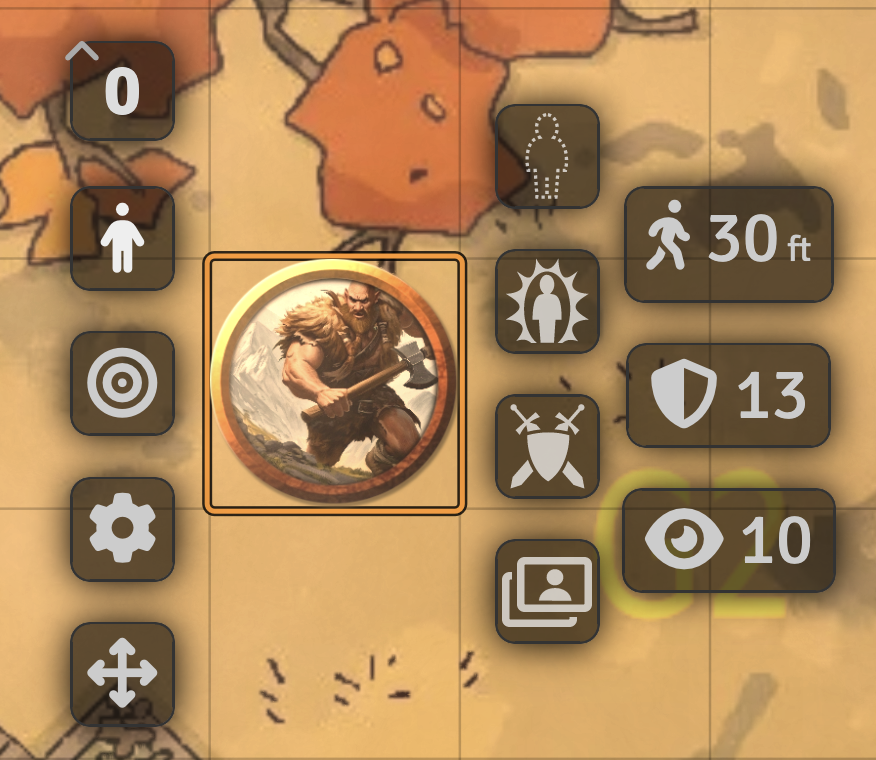
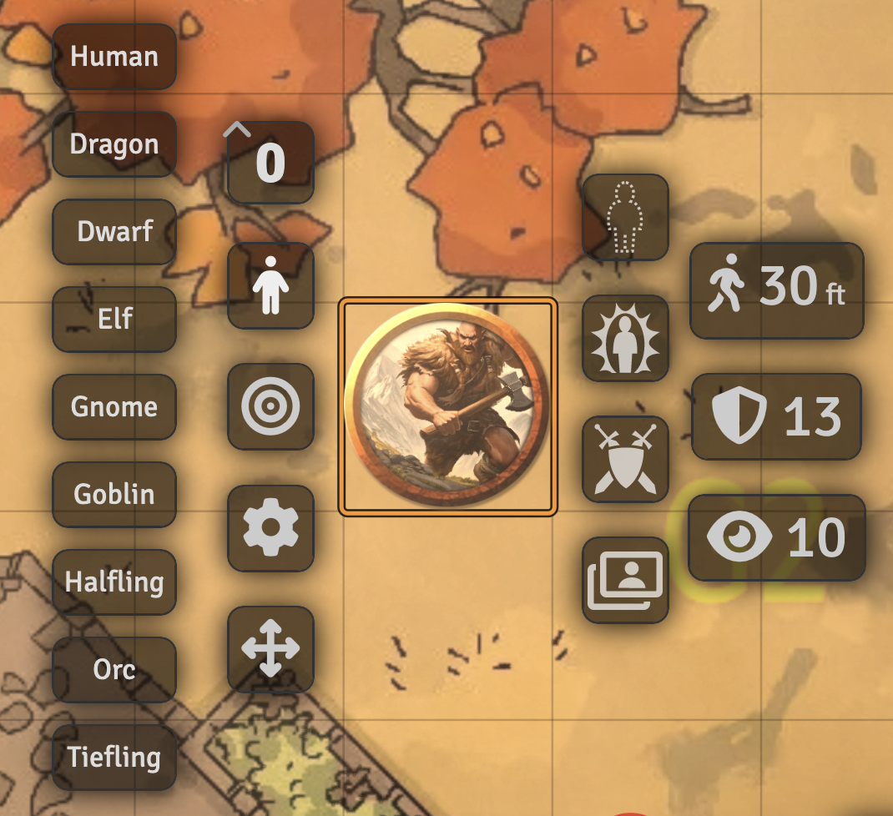

)].download_count&url=https%3A%2F%2Fapi.github.com%2Frepos%2Fchrisjbrown%2Fmy-names-jeff%2Freleases)
# My-Names-Jeff (https://foundryvtt.com/packages/my-names-jeff/)

* **Author**: bluegreymouse (Discord)
* **Email**: chrisjobrown@gmail.com
* **Foundry VTT Compatibility**:
  - Foundry v11 - Latest release
* **System Compatibility**: All systems.

## Installation
Search in module list, install, profit

## Description
**Only for unlinked tokens and GM users

Drop an unlinked token on a scene. Right click. See a new person icon button to left of token. Click this icon button. See a list of token name types to choose from. Select one and Notice that your tokens name has been updated to a random first/last name based on your selection.

## Reasoning
This module is born out of a need for better name randomization. Large story games have a lot of side characters which led my players to immediately recognizing "Commoner(2)" or "Lazy Commoner" as side characters and thus less important. Token mold has an interesting name generation algorithm however I found quite some bugs related to it and, at least at time of writing, conflicts with [Token Variant Art](https://github.com/Aedif/TokenVariants/tree/master) which I use heavily.

As I'm using TVA heavily and often choosing just the right image after dropping an actor on a scene I wanted to then quickly update the token name to better represent the TVA image I had chosen. Thus my-names-jeff is created. It is an incredibly simple module for a reason and if anyone wants to absorb it into a larger module please go for it :D

## Name tables
I've taken names directly from [Monks Enhanced Journal](https://github.com/ironmonk88/monks-enhanced-journal/tree/main), so shout out to them! This was the best table of names for different "humanoid beings?" I could find. I copied rather than referenced with the idea of limiting dependencies as well as allowing this to grow further with more names and different types.

## Contributing
Feel free to offer suggestions, open PR's for improvements, or just expand upon the name tables. All would be very appreciated.