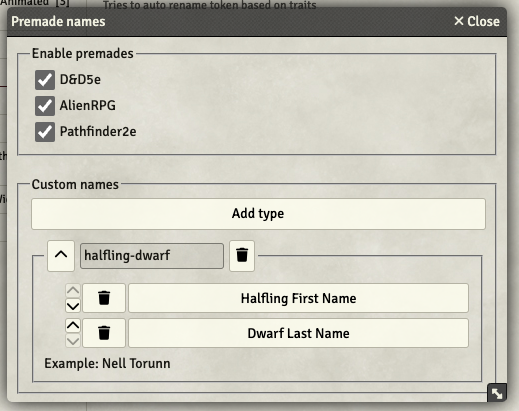
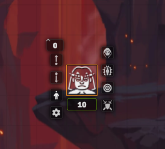
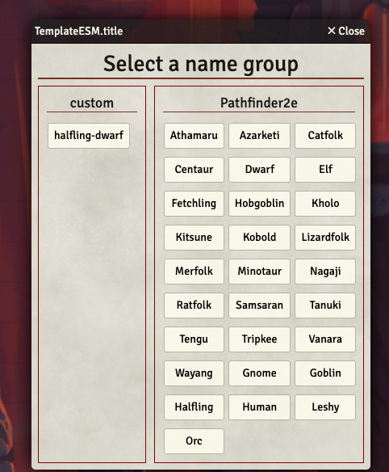
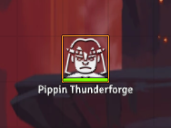
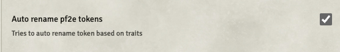
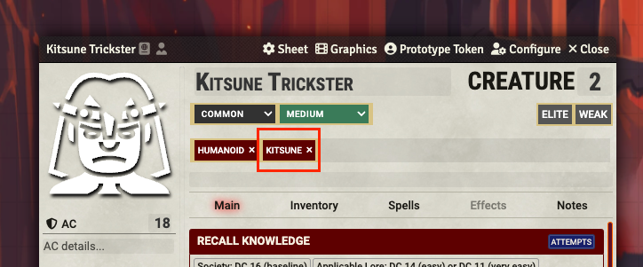

 

# My Names Jeff

**Only for unlinked tokens and GM users

Drop an unlinked token on a scene. Right click. See a new person icon button to left of token. Click this icon button. See a list of token name types to choose from. Select one and Notice that your tokens name has been updated to a random first/last name based on your selection.

## Reasoning
This module is born out of a need for better name randomization. Large story games have a lot of side characters which led my players to immediately recognizing "Commoner(2)" or "Lazy Commoner" as side characters and thus less important. Token mold has an interesting name generation algorithm however I found quite some bugs related to it and, at least at time of writing, conflicts with [Token Variant Art](https://github.com/Aedif/TokenVariants/tree/master) which I use heavily.

As I'm using TVA heavily and often choosing just the right image after dropping an actor on a scene I wanted to then quickly update the token name to better represent the TVA image I had chosen. Thus my-names-jeff is created. It is an incredibly simple module for a reason and if anyone wants to absorb it into a larger module please go for it :D

## Name tables
I've taken names directly from [Monks Enhanced Journal](https://github.com/ironmonk88/monks-enhanced-journal/tree/main), so shout out to them! This was the best table of names for different "humanoid beings?" I could find. I copied rather than referenced with the idea of limiting dependencies as well as allowing this to grow further with more names and different types.

I've extended these names for other fantasy and sci-fi races by using AI to generate names. See compendium pack person-names for more.

## Settings and use
1. Enable the module
2. In settings select the premade names you want to use.
    - These are pre configured name groups for common races of different systems eg: pf2e and d&d
3. Add optional races by supplying a name and drag and drop rolltables for producing names
    - 

4. After dropping an unlinked NPC actor in a scene, right click the actor, select person icon
    - 

5. This renders a name selection panel, click the desired name group
    - 

6. Notice the tokens name has been updated
    - 

## PF2E specific
1. If you would like the module to try and auto rename unlinked NPC actors, you can enable this option
    - 

2. When dropping an unlinked NPC token the module will look for the first trait tag that matches any premade name key
    - 

3. If found it will rename the token when it is dropped on the canvas, if not it will leave it alone
    - 

# Installation

## Method 1

1. On Foundry VTT's **Configuration and Setup** screen, go to **Add-on Modules**
2. Click **Install Module**
3. Search for **My names jeff**
4. Click **Install** next to the module listing

## Method 2

1. On Foundry VTT's **Configuration and Setup** screen, go to **Add-on Modules**
2. Click **Install Module**
3. In the Manifest URL field, paste: `https://github.com/chrisjbrown/my-names-jeff/releases/latest/download/module.json`
4. Click **Install** next to the pasted Manifest URL

# For Developers

# Support

Pull requests are welcome. Please include a reason for the request or create an issue before starting one.

# Acknowledgements

Thank you to the Community Helpers on Foundry's Discord.

# License

This Foundry VTT module is licensed under a [Creative Commons Attribution 4.0 International License](https://creativecommons.org/licenses/by/4.0/) and this work is licensed under [Foundry Virtual Tabletop EULA - Limited License Agreement for module development](https://foundryvtt.com/article/license/).
